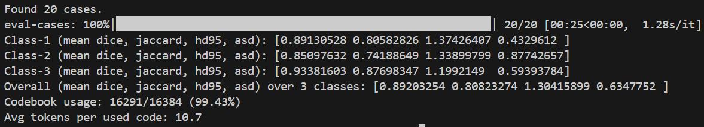
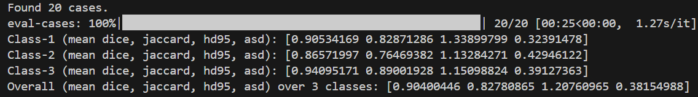

# VQ-Seg
(NeurIPS 2025) VQ-Seg: Vector-Quantized Token Perturbation for Semi-Supervised Medical Image Segmentation

## Paper
[🔍VQ-Seg Paper Link](https://openreview.net/pdf?id=Gt8iKyg12u)

## Code Release Notes

**2026.01.14 — Initial Release (v1)**  

This is the **first public release** of VQ-Seg.
Due to a device migration during my graduate application period, several components were re-implemented, and the current version may still require additional polishing and hyperparameter tuning to achieve the best performance.

I am actively refining the repository. Suggestions and feedback are always welcome.
Please feel free to contact me at syang671@connect.hkust-gz.edu.cn or open an issue.

## Implementations

### Installation

- **Dependencies**:  
  Install all required packages via:  
  `pip install -r requirements.txt`

- **Pretrained Weights**:  
  This project uses **DINOv2** as the backbone.  
  Please download the corresponding pretrained weights (e.g., dinov2-small) and set the `weights_path` in the script.

- **Dataset Preparation**:  
  Prepare your dataset following the structure below.
  

### Dataset Structure

```bash
XXX/
│
├── train-label/                # Labeled training set
│   ├── image/                  # Input images (.png)
│   └── mask/                   # Corresponding segmentation masks (.png)
│
├── train-unlabel/              # Unlabeled training set
│   └── image/                  # Images without ground truth masks
│   └── mask/                  
│
├── val/                        # Validation set
│   ├── image/                  # Validation images (.png)
│   └── mask/                   # Validation masks (.png)
│
└── test/                       # Test set
    ├── image/                  # Test images (.png)
    └── mask/                   # Test masks (optional)
```

### Description

- **train-label**  
  Contains paired image–mask samples used for supervised segmentation training.

- **train-unlabel**  
  Contains images without ground-truth annotations, utilized for semi-supervised learning.

- **val**  
  Used to monitor and validate model performance during training.

- **test**  
  Used for final evaluation and benchmarking.


### Dataset Download

I created a convenient PNG-formatted version of the ACDC dataset.  
This version was converted from the files provided in the SSL4MIS repository:  
[SSL4MIS ACDC Version](https://github.com/HiLab-git/SSL4MIS/tree/master/data/ACDC)
 
If you use the dataset in your research, please make sure to cite the **original ACDC paper**.

**Download:**  
👉 *[ACDC-PNG Dataset (Our converted version, Google Drive)](https://drive.google.com/file/d/1MSj1GEK1bVLjkBkUDG57Ir6eKeE_Dxrl/view?usp=drive_link)*


## Training
```bash
python train.py
```
## Inference
```bash
python test.py
```
## Expected Results

I recently reproduced the experiments on a newly configured machine.  
With a short training session on the ACDC dataset, the model achieves the following test performance:

**ACDC 5% Labeled**  


**ACDC 10% Labeled**  


Please note that these results are not fully optimized. With further hyperparameter tuning and module adjustments, the model can achieve significantly better performance. The current results serve as an initial demonstration of the strong competitiveness of the proposed method.

## Tips

1. **DB module is not included in this release.**  
   Although the DB framework mentioned in the paper can slightly improve performance, it introduces additional computational overhead.  
   To ensure fairness and maintain efficiency, this implementation uses only the main backbone, which is already sufficiently strong.

2. **Dataset-specific hyperparameter tuning is recommended.**  
   In particular, avoid assigning an excessively large weight to the USE Loss, as this may cause the model to over-focus on codebook utilization rather than segmentation performance.

3. **Validation results are not equivalent to test results.**  
   Please run the test script separately to obtain final performance metrics.

## Acknowledgement

The VQSeg codebase adapts components from [UniMatch](https://github.com/LiheYoung/UniMatch).  
We thank the authors for their excellent work.

## Citation

If you find this work useful in your research, please consider citing:

```bibtex
@inproceedings{yangvq,
  title={VQ-Seg: Vector-Quantized Token Perturbation for Semi-Supervised Medical Image Segmentation},
  author={Yang, Sicheng and Xing, Zhaohu and Zhu, Lei},
  booktitle={The Thirty-ninth Annual Conference on Neural Information Processing Systems}
}
```
